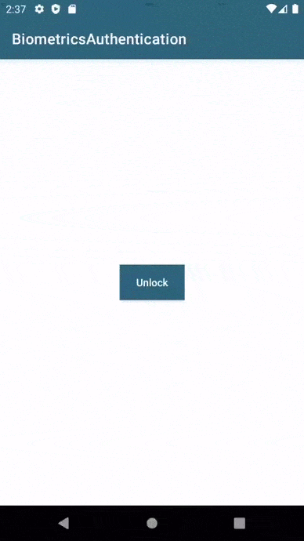

# Biometrics Authentication in Android #

[](https://developer.android.com/studio/)
[](https://kotlinlang.org)
[](https://android-arsenal.com/api?level=19)


### This applications is sample for Biometrics Authentication in Android using Biometrics API ###


### This application provides the below feature ###

* Fingerprint Authentication
* PIN/Password/Pattern Authentication

### Pre-requisites ###

* Android studio 4.0+
* Android Build Tools v30.0.3
* Kotlin 1.4.10

### Tech/framework used ###

* 100% kotlin


## Find this example useful? :heart:
Support it by joining __[stargazers](https://github.com/SimformSolutionsPvtLtd/SSBiometricsAuthentication/stargazers)__ for this repository. :star:
## License

```
Copyright 2020 Simform Solutions

   Licensed under the Apache License, Version 2.0 (the "License");
   you may not use this file except in compliance with the License.
   You may obtain a copy of the License at

       http://www.apache.org/licenses/LICENSE-2.0

   Unless required by applicable law or agreed to in writing, software
   distributed under the License is distributed on an "AS IS" BASIS,
   WITHOUT WARRANTIES OR CONDITIONS OF ANY KIND, either express or implied.
   See the License for the specific language governing permissions and
   limitations under the License.
```