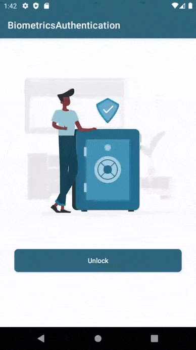

# Biometrics Authentication in Android #

[](https://developer.android.com/studio/)
[](https://kotlinlang.org)
[](https://android-arsenal.com/api?level=21)

### Biometrics API
* With the launch of Android 10 (API level 29), developers can now use the Biometric API, part of the AndroidX Biometric Library, for all their on-device user authentication needs.
* The Android Framework and Security team has added a number of significant features to the AndroidX Biometric Library, which makes all of the biometric behavior from Android 10 available to all devices that run Android 6.0 (API level 23) or higher.
* In addition to supporting multiple biometric authentication form factors, the API has made it much easier for developers to check whether a given device has biometric sensors. And if there are no biometric sensors present, the API allows developers to specify whether they want to use device credentials in their apps.

### About this project :
* This applications is sample for Biometrics Authentication in Android using Biometrics API

| Finger Print Unlock | Face Unlock |
|--|--|
|  |  |

### This application provides the below feature

* Fingerprint Authentication
* Face Authentication
* PIN/Password/Pattern Authentication

### How it works :
1. Add the Gradle dependency to your app module

```groovy
    def biometric_version=  '1.2.0-alpha04'
    implementation "androidx.biometric:biometric:$biometric_version"
```

2. Check whether the device supports biometric authentication

```kotlin
    val biometricManager =  BiometricManager.from(context)
    if(biometricManager.canAuthenticate()  ==  BiometricManager.BIOMETRIC_SUCCESS){
	    // you can authenticate with biometrics
    }
```

3. Create an instance of BiometricPrompt

```kotlin
    private fun instanceOfBiometricPrompt():  BiometricPrompt  {
        val executor =  ContextCompat.getmainExecutor(context)
        val callback =  object:BiometricPrompt.AuthenticationCallback()  {
            override fun onAuthenticationError(errorCode:  Int, errString:  CharSequence) {
                super.onAuthenticationError(errorCode, errString)
                showMessage("$errorCode :: $errString")
            }
            override fun onAuthenticationFailed()  {
                super.onAuthenticationFailed()
                showMessage("Authentication failed for an unknown reason")
            }
            override fun onAuthenticationSucceeded(result:  BiometricPrompt.AuthenticationResult{
                super.onAuthenticationSucceeded(result)
                showMessage("Authentication was successful")
            }
        }
        val biometricPrompt =  BiometricPrompt(context, executor, callback)
        return biometricPrompt
    }
```

4. Build a PromptInfo object

```kotlin
    promptInfo =  BiometricPrompt.PromptInfo.Builder()
	    .setTitle("Biometric login for my app")
	    .setSubtitle("Log in using your biometric credential")
	    // Can't call setNegativeButtonText() and  // setAllowedAuthenticators(... or DEVICE_CREDENTIAL) at the same time.//
	    //.setNegativeButtonText("Use account password") //
	    .setAllowedAuthenticators(BIOMETRIC_WEAK or DEVICE_CREDENTIAL)
	    .build()
```

5.  Ask the user to authenticate

```kotlin
    biometricPrompt.authenticate(promptInfo)
```

### For API level 21 -23 :
* For API level 21-23, you need to check whether Screen lock is enabled or not before authentication.
```kotlin
    keyguardManager = getSystemService(KEYGUARD_SERVICE) as KeyguardManager
    if (keyguardManager.isKeyguardSecure) {
        //Screen lock is enabled, do authentication.
    }
```
* If screen lock is not enabled than use below code to navigate user to setting screen for set up of Screen lock.
```kotlin
    startActivityForResult(Intent(Settings.ACTION_SECURITY_SETTINGS), REQUEST_CODE)
```

For more info go to __[Android Developers Biometric Blog](https://android-developers.googleblog.com/2019/10/one-biometric-api-over-all-android.html)__

## Find this example useful? :heart:
Support it by joining __[stargazers](https://github.com/SimformSolutionsPvtLtd/SSBiometricsAuthentication/stargazers)__ for this repository. :star:

## Awesome Mobile Libraries
- Check out our other available [awesome mobile libraries](https://github.com/SimformSolutionsPvtLtd/Awesome-Mobile-Libraries)

## License

```
Copyright 2022 Simform Solutions

 Licensed under the Apache License, Version 2.0 (the "License");
 you may not use this file except in compliance with the License.
 You may obtain a copy of the License at
 
    http://www.apache.org/licenses/LICENSE-2.0
 
 Unless required by applicable law or agreed to in writing, software
 distributed under the License is distributed on an "AS IS" BASIS,
 WITHOUT WARRANTIES OR CONDITIONS OF ANY KIND, either express or implied.
 See the License for the specific language governing permissions and limitations under the License.
```
